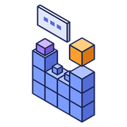

<p align="center">
  
</p>

<h1 align="center">AI Builder</h1>

<p align="center">
  Builds and edits structures from a chat or a reference picture: "build a small castle", "add a tower on the east side",<br>
  "replace the stone bricks with 70% stone bricks and 30% mossy". The AI runs on your own PC by default.
</p>

<p align="center">
  <a href="https://github.com/doolecg/BlockDesigner-AIBuilder/releases/latest"></a>
  <a href="https://github.com/doolecg/BlockDesigner-AIBuilder/releases"></a>
  <a href="LICENSE"></a>
  
  <a href="https://github.com/doolecg/BlockDesigner"></a>
</p>

---

AI Builder is a plugin for [BlockDesigner](https://github.com/doolecg/BlockDesigner), the Windows editor for Minecraft builds. It is released
on its own, separately from the app. It needs **BlockDesigner 0.4.24 or later** (plugin API 6).

**Contents:** [Download](#download-and-install) · [Features](#features) · [Building from source](#building-from-source) · [Project layout](#project-layout)

## Download and install

Get the latest version from the [releases page](https://github.com/doolecg/BlockDesigner-AIBuilder/releases/latest):

1. Download `ai-builder-<version>.jar`.
2. In BlockDesigner open **Plugins (puzzle icon) › Manage plugins… › Install…** and pick the jar.

It is on straight away, with **Assistant** and **Models** pages in its tab on the right. You can switch it off, reload or uninstall it in the same
window, and it updates itself (Plugins › Manage plugins… › Update plugins automatically). Plugins run with the same access as BlockDesigner
itself, so only install ones you trust.

The first time, the Assistant page offers to **download Gemma 4 E4B (5.2 GB)**. That is the only big download; it runs in the background and
resumes if it is interrupted.

## Features

### The Assistant page

- **Chat to build.** Ask for a build or a change. The reply streams in: a short plan, then the commands it runs. The commands can be opened
  under each answer, with a tick or a cross and the reason for each line.
- **What it works on** (at the top): the selection when there is one; otherwise everything visible; a **new build** goes into a layer of its
  own (on an empty scene, or when you pick *New build*). The line under it says which, e.g. "Editing: selection 12×9×20". The pencil starts a
  new chat.
- **One undo step per answer.** Ctrl+Z takes it back, or **Undo this** under the answer.
- **It fixes its own mistakes.** Commands are tried on a copy of the scene first. If some fail, the errors go back to the model, up to three
  times, before anything changes.
- **Styles:** medieval, rustic, desert, nordic, fantasy and modern palettes (walls, trim, roof, floor, glass, accent, door), or let it pick.
  Ask for one in your message, or set the **Default style** in Settings.
- **Reference pictures.** Attach a picture (or drop it on the page). Models that see pictures get the picture; every model gets its main colours
  matched to the nearest building blocks.
- **Stop** ends an answer at once; nothing changes. While it answers, the page's button shows a dot; an error shows above the message box
  with a way to the Models page.

### The Models page

- **Where answers come from:** the built-in model on this PC, your own local server (Ollama, LM Studio, any OpenAI-compatible address), or your
  own **Claude** or **OpenAI** API key. The page shows only what the chosen one needs, and at the bottom whether it is ready.
- **Built-in models**, each with its size, the memory it needs, its licence and whether it sees pictures:
  - **Gemma 4 E4B** (recommended, 5.2 GB, Apache-2.0)
  - **Qwen2.5-VL 3B** (light, 2.8 GB)
  - **Qwen3-VL 8B** (quality, 6.2 GB)
  - **Gemma 3 12B** (big, 8.2 GB)
  - Download, Cancel, Use and Delete, with progress, speed and time left. Downloads resume where they stopped and are checked against their size.
- **Engine:** the models run on [llama.cpp](https://github.com/ggml-org/llama.cpp), downloaded the first time (graphics card, CPU only, or
  NVIDIA CUDA). If the graphics card build won't start, the CPU build is used.
- **Background model:** Stopped, Starting or Running, with Start and Stop. It runs hidden on 127.0.0.1 and stops when the plugin is turned off
  or BlockDesigner closes.
- **API key** (with Claude or OpenAI): type it and press Enter; it is saved encrypted for your Windows account (DPAPI). **Remove key** deletes it.
- **Custom model** (folded away): add any GGUF model from Hugging Face (and its vision projector) to the list.

### Settings

AI Builder's page in BlockDesigner's **Settings** window (the gear on its tab opens it) has the settings you set once: where answers come
from and the connection details for a local server, Claude or OpenAI; the engine kind, *start it when BlockDesigner starts* and *stop it when
unused* (10, 30 or 60 minutes); the **Default style**; and, under Advanced, the context size and the most blocks per answer. Settings from
earlier versions move there by themselves.

### Builder commands for BlockEdit

The plugin adds these to BlockEdit, so they work in the command bar (T or /) as well as for the assistant. Each lays whole parts with the stairs
and slabs facing the right way:

| Command | What it does |
|---|---|
| `/setblock x y z <block>` | One block, as in Minecraft (`~` is relative to the aimed block) |
| `/fill x1 y1 z1 x2 y2 z2 <block> [hollow\|outline\|keep\|replace <filter>]` | A box, as in Minecraft; the block can be a mix like `70%stone_bricks,30%mossy_stone_bricks` |
| `/tower <radius> <height> [cone\|flat\|battlements] [wall] [roof] [at x y z]` | A round tower with a stair-stepped cone roof, a flat top or battlements |
| `/roof <gable\|hip\|pyramid\|flat> [material] [x\|z] [overhang=n]` | A roof on top of the region, with closed gable ends |
| `/battlements [material]` | Crenellations along the top of the region |
| `/windows [glass] [spacing] [height]` | Windows cut evenly and symmetrically into the region's walls |
| `/door [material] [north\|south\|east\|west]` | A two-high door in the middle of that wall |
| `/gatehouse [wall]` | Walls, an arched gate through the middle, a roof and battlements |
| `/floors <n> [material]` | Storeys with a floor inside the walls on each |

Blocks can be style placeholders such as `@wall` or `@desert.roof`.

### Privacy

With the built-in model or a local server, nothing leaves your PC. With an API key, the scene summary (layer names, sizes, block counts and a
coarse height map), your messages and any attached picture go to that company.

## Building from source

You need Windows and a JDK 26 (Temurin 26 is what BlockDesigner uses; set `org.gradle.java.home` in
`gradle.properties` to yours). Then:

```
./gradlew jar      # build/libs/ai-builder-<version>.jar
```

The plugin compiles against the BlockDesigner plugin API jars in [`libs/`](libs) (from BlockDesigner 0.4.27). The app
provides them, Jackson and JavaFX at runtime, so they are never bundled into the plugin. To target a newer API, replace them
with the jars from a newer BlockDesigner build (`./gradlew :plugin-api:jar :core:jar` in the
[BlockDesigner repository](https://github.com/doolecg/BlockDesigner)) and update the file names in `build.gradle.kts`.

The version is set in `build.gradle.kts` and copied into the jar's `blockdesigner-plugin.json`. To release a new
version, change it there, add a section to [RELEASE_NOTES.md](RELEASE_NOTES.md), build the jar and attach it to a
GitHub release tagged with the version.

For writing plugins, see BlockDesigner's [plugin guide](https://github.com/doolecg/BlockDesigner/blob/main/PLUGINS.md) and
[API reference](https://github.com/doolecg/BlockDesigner/blob/main/docs/plugin-api-reference.md).

### Tests

```
./gradlew test
```

The tests need no model, no network and no keys: the builder commands run against an in-memory world, downloads and the engine against a
local HTTP server, the chat clients against fake OpenAI-style and Anthropic-style streams, and the assistant against a scripted model.

## Project layout

| Path | What it does |
|---|---|
| `src/main/java/.../build` | The command runner (`BuildRunner`), `/setblock` and `/fill` (`VanillaCommands`), the generators (`Generators`), `Styles`, block shapes (`Materials`), and reading commands out of a reply (`CommandScript`) |
| `src/main/java/.../models` | The model list (`ModelCatalog`, `models.json`), resumable downloads (`Downloader`, `DownloadJob`), downloaded models (`ModelStore`), the llama.cpp engine (`Engine`) and the background server (`LocalServer`, `LocalModels`) |
| `src/main/java/.../llm` | The chat clients (`OpenAiCompatibleClient`, `AnthropicClient`), streaming, and encrypted API keys (`Secrets`) |
| `src/main/java/.../agent` | The conversation (`Assistant`), what it works on (`Scope`), the scene description (`SceneSummary`) and the instructions (`SystemPrompt`) |
| `src/main/java/.../image` | Reference pictures (`Attachment`) and their colours as block hints (`ImageHints`) |
| `src/main/java/.../ui` | The Assistant and Models pages |
| `src/main/resources/blockdesigner-plugin.json` | The manifest BlockDesigner reads: id, name, version, main class, API level |
| `src/test/java` | Tests |
| `libs/` | The BlockDesigner plugin API jars it compiles against |
| `docs/plan.md` | The plan for this plugin and what is done |

## License

[MIT](LICENSE). The models have their own licences, shown on the Models page.
